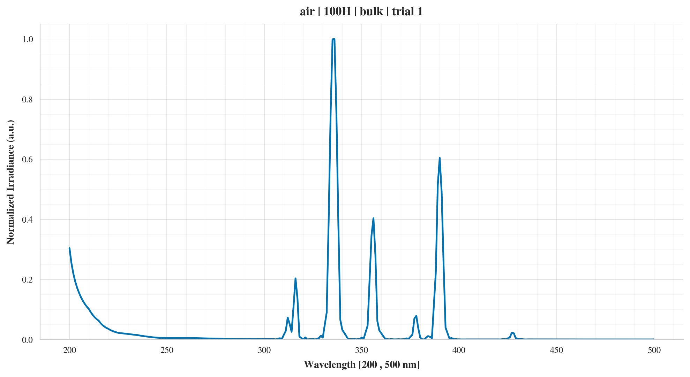
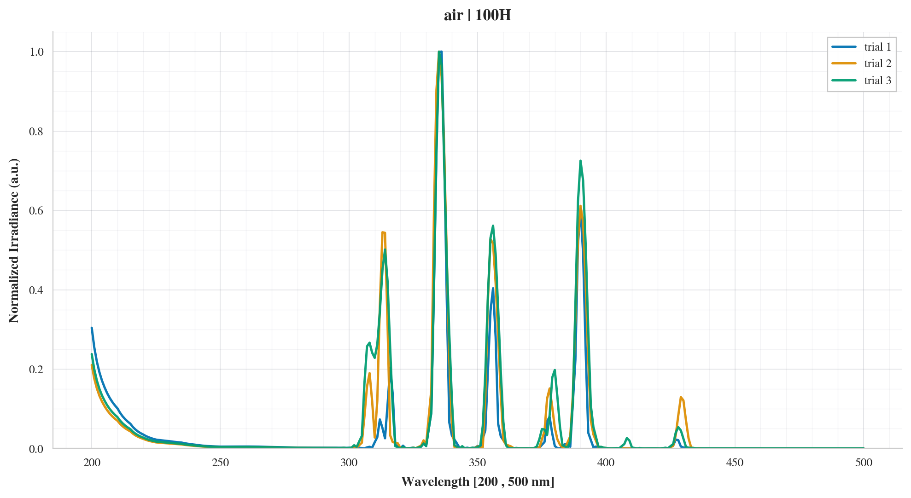
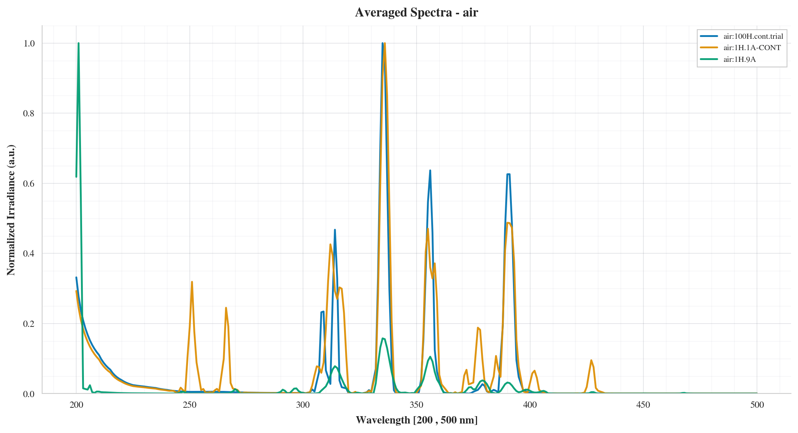
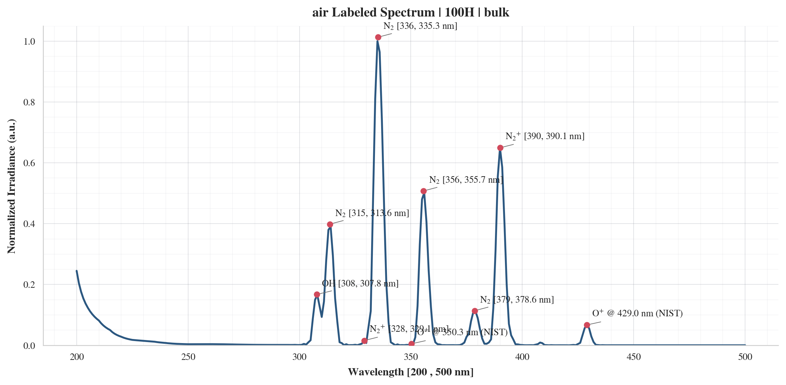
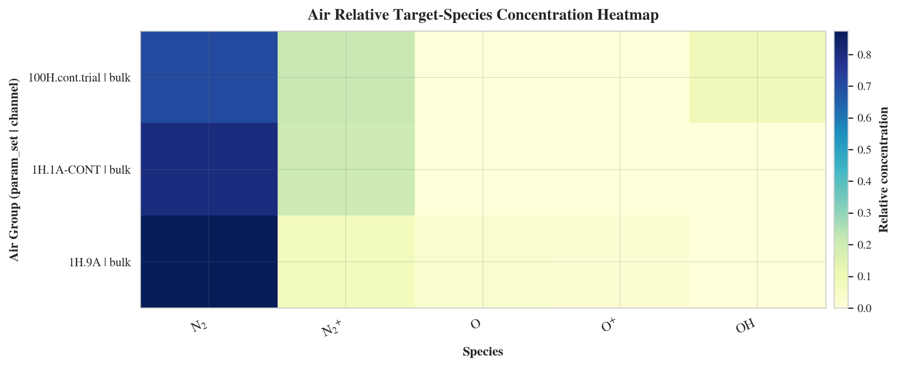
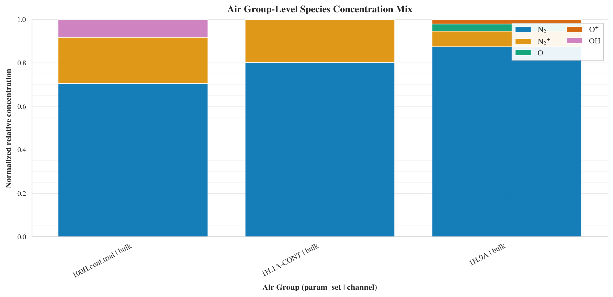
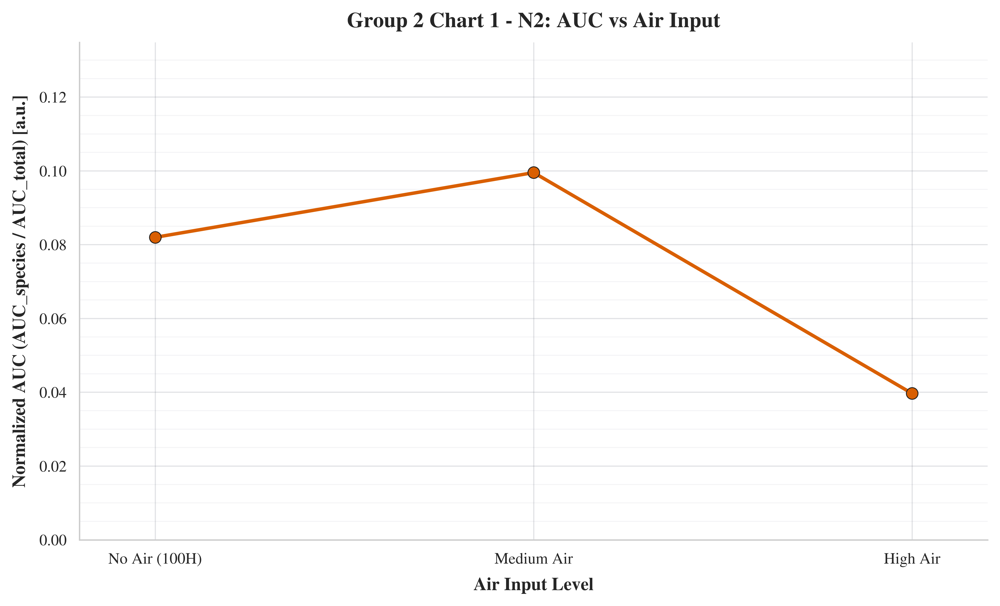
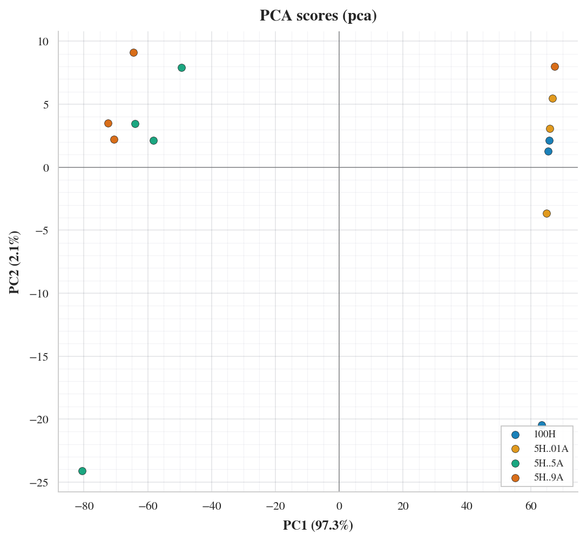
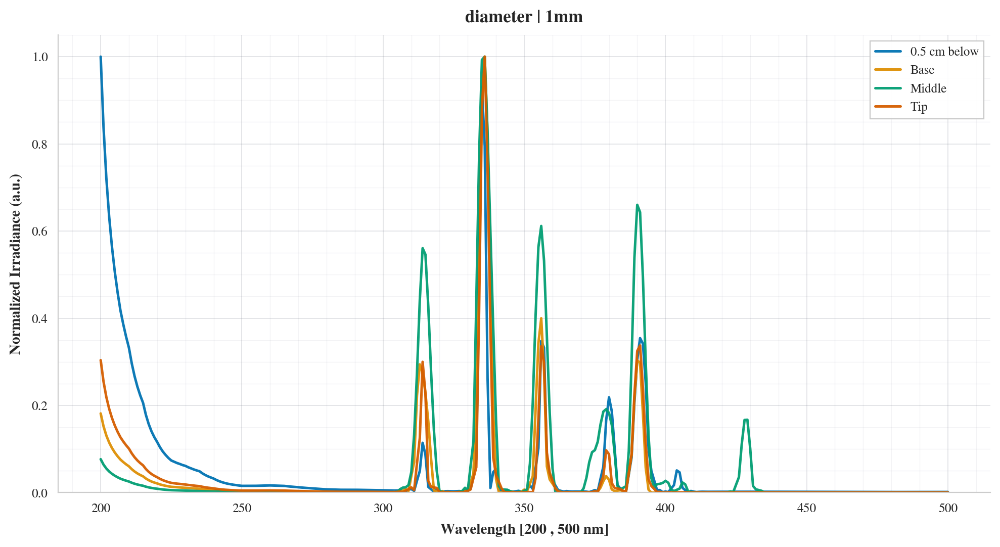
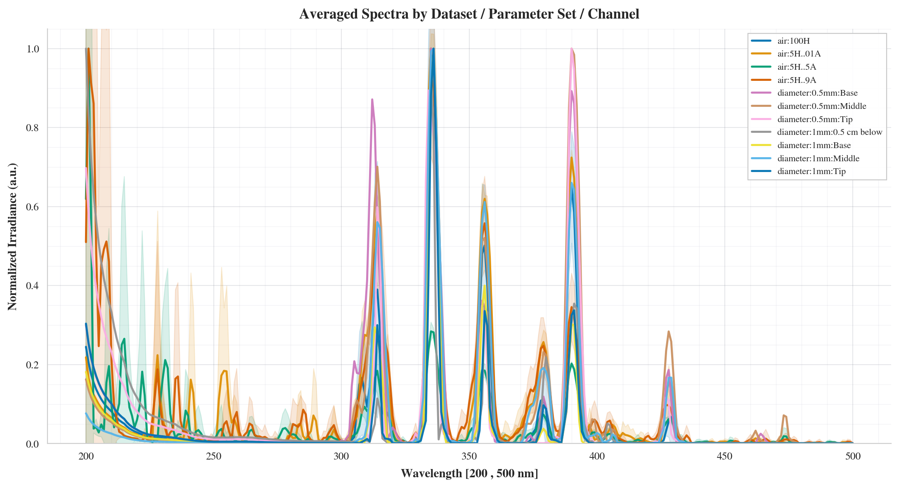

# Dual Experimental Plasma Data Analysis

This work is part of an undergraduate research project on non-thermal plasma. The analysis tracks reactive species of interest (`N2`, `N2+`, `OH`, `O II`) because they are relevant to medical sterilization performance and potential healing-related bioeffects.

This workflow runs from raw plasma spectra CSV inputs in `data/air` and `data/diameter` and writes final outputs directly to `output/air`, `output/diameter`, and `output/meta` in one pass (`python run.py`). The pipeline parses and standardizes spectra (`preprocess`), generates individual/composed/compared spectral charts, computes averaged curves and top peaks, matches peaks to configured target species lines and NIST candidate lines, derives feature tables for statistics, runs species concentration aggregation, runs PCA, writes labeled spectra and diagnostics, and then builds one Excel report per scope. Final scoped outputs are organized under `spectral/base/raw` (traceable CSVs), `spectral/base/charts` (unlabeled figures), `spectral/labels` (species-labeled figures), `chemspecies/csv`, `chemspecies/figures`, `pca`, and `<scope>_executive_report.xlsx`.

Air findings: the air scope contains 14 samples across 4 parameter/channel groups, with 24 matched target-species lines out of 60 target checks (40.0% match coverage). Mean relative species concentration is dominated by `N2` (70.2%), followed by `N2+` (25.0%) and `OH` (6.4%). PCA on air features shows variance concentrated in PC1 (97.3%) with PC2 at 2.1%, indicating one dominant axis of air-condition variation.

## Air figure narrative (and diameter/meta context)

The air scope currently writes 38 figures under `output/air`:

- `spectral/base/charts/individual/*.png` (14): trial-level spectra for each air condition replicate (`100H`, `5H..01A`, `5H..5A`, `5H..9A`) used to inspect repeatability before aggregation. These are the air analog to diameter channel-level plots (`tip/middle/base`) and are reflected in meta diagnostics (`fig3_trial_repeatability.png`).
- `spectral/base/charts/composed/*.png` (4): within-condition overlays (`100h.png`, `5h_01a.png`, `5h_5a.png`, `5h_9a.png`) that summarize replicate behavior. They pair with diameter composed overlays (`0_5mm.png`, `1mm.png`) to show air-input effects versus geometric (diameter/channel) effects.
- `spectral/base/charts/compared/*.png` (4): cross-condition air comparisons (`air.png` plus `air_100h_vs_01a/5a/9a.png`) that frame the principal within-air shifts. These feed directly into the meta combined comparison view (`output/meta/spectral/base/charts/compared/combined.png`).
- `spectral/labels/*.png` (4): labeled averaged spectra per air condition, linking prominent peaks to target/NIST species assignments. These are the air subset of the meta labeled panel (which includes both air and diameter labels) for traceable cross-scope interpretation.
- `chemspecies/figures/air_*.png` (4): species concentration heatmap, parameter-species heatmap, species-mix bars, and ranked-species variability view. Together they explain why air appears `OH`-enriched relative to diameter, consistent with `fig3_air_vs_diameter_species_delta.png` in meta.
- `chemspecies/figures/air_reactive_auc/.../*.png` (7): reactive-species AUC charts (4 condition-wise species mixes + 3 species-wise trends across air input), providing the direct intensity-based perspective behind the normalized species summaries.
- `pca/pca_scores.png` (1): low-dimensional separation of air samples with dominant PC1 loading. Compared with diameter PCA (higher PC2 share), this supports the meta result that the combined dataset remains PC1-dominant with a secondary air-vs-diameter axis.

### Diameter/meta context figures

Diameter findings: the diameter scope contains 7 samples across 7 parameter/channel groups, with 49 matched target-species lines out of 105 target checks (46.7% match coverage). Mean relative species concentration is dominated by `N2` (73.9%) and `N2+` (25.5%), with small `O II` (0.7%) and `OH` (0.6%) contributions. PCA on diameter features shows PC1 at 93.2% and PC2 at 6.5%, indicating stronger secondary variation than air, consistent with tip/middle/base and diameter-parameter differences.

Meta findings: the meta scope combines air and diameter into 21 samples across 11 groups, with 73 matched target-species lines out of 165 checks (44.2% match coverage). Combined mean relative concentration is `N2` 72.5%, `N2+` 25.3%, `OH` 2.8%, and `O II` 0.7%. Air-vs-diameter delta shows the largest species difference in `OH` (air higher by 0.0577 absolute relative-concentration units), while diameter is higher for `N2` (-0.0363 air-minus-diameter), and slightly higher for `O II` and `N2+`; PCA in meta remains PC1-dominant (96.0%) with PC2 at 3.3%.
